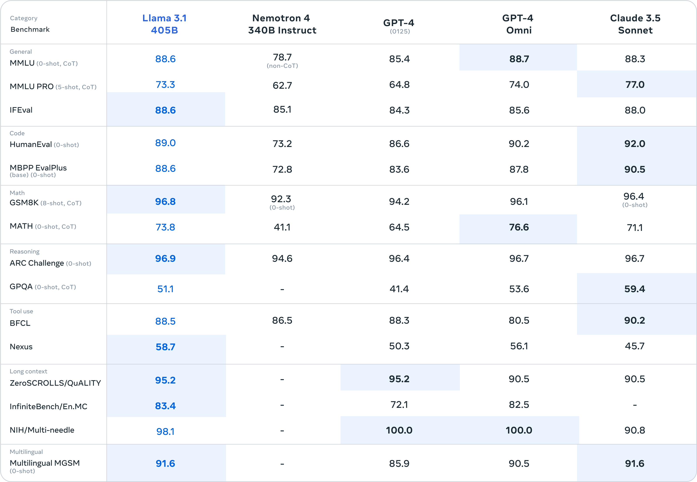
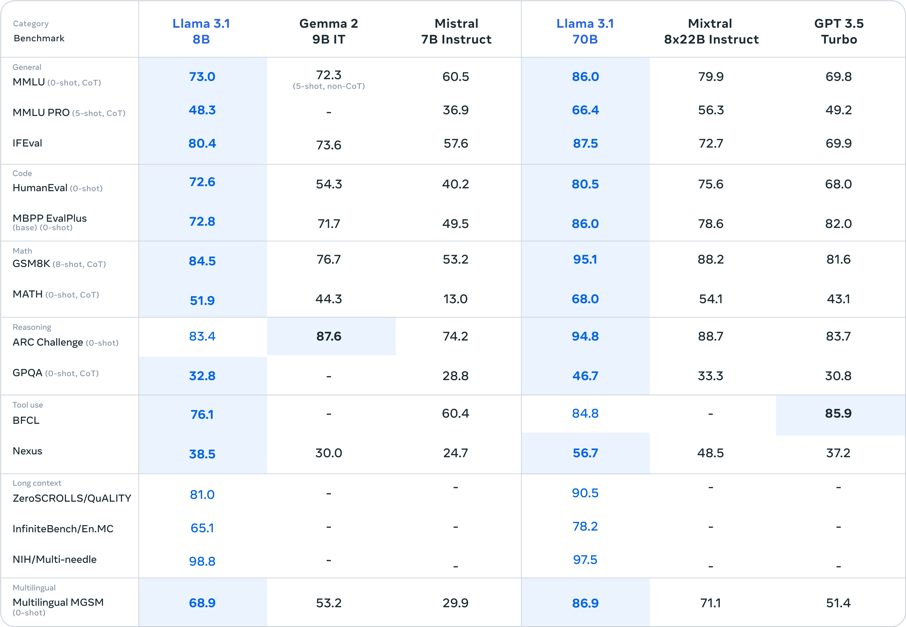
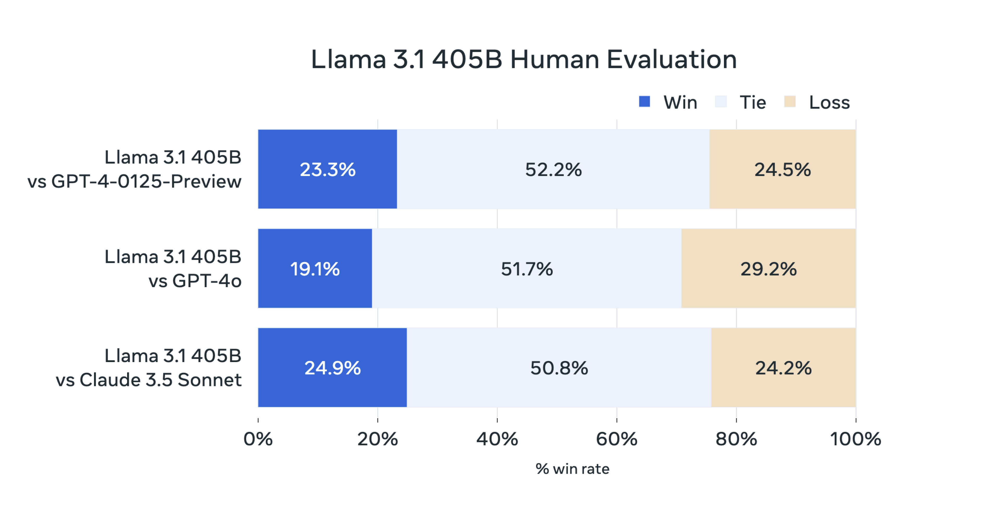
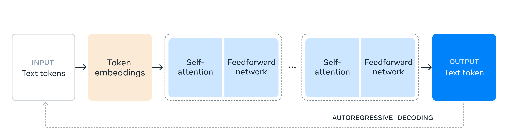

# Docs.AI RAG Chatbot


## Introduction
Docs.AI RAG Chatbot is an advanced application designed to revolutionize document interactions through AI-driven capabilities. By leveraging Retrieval-Augmented Generation (RAG) techniques and integrating state-of-the-art Large Language Models (LLMs) like Llama3.1, Docs.AI allows users to engage in natural language conversations with their documents, enabling efficient querying, retrieval, summarization, and content generation.




## Key Features
- **Natural Language Conversations:** Interact with documents using conversational language inputs.
- **Retrieval-Augmented Generation (RAG):** Combine document retrieval with content generation for contextually relevant responses.
- **LLM Integration:** Utilize Llama3.1 for accurate and context-aware natural language processing.
- **User-Friendly Interface:** Designed with HTML5 and CSS3 for easy navigation and efficient access.
- **AI-driven Document Management:** Enhance document search, retrieval, summarization, and content generation with advanced AI algorithms.
- **Cloud and Local Model Execution:** Use API for cloud-based execution and Ollama for running the model locally.




## Target Audience
- **Professionals, Researchers, Educators, Knowledge Workers:** For efficient document handling in daily workflows.
- **AI Enthusiasts and Technologists:** For exploring advanced AI techniques in document management.

## Value Proposition
- **Efficiency and Productivity:** Streamline document interactions, saving time and enhancing productivity.
- **Intelligent Document Insights:** Extract valuable insights through intelligent querying and summarization.
- **Future-ready AI Integration:** Leverage cutting-edge AI for intelligent document management solutions.

## Strategic Importance
- **Technological Advancements:** Showcase practical applications of RAG and LLMs.
- **Competitive Edge:** Offer innovative features and enhanced user experiences compared to traditional solutions.

## Innovation and Impact
- **Innovative AI Techniques:** Set new standards in AI-driven document management.
- **User Experience Enhancement:** Provide a conversational interface for improved user engagement and satisfaction.

## Feasibility Study

### Technical Feasibility
- **Hardware Requirements:** Verified CPU, GPU, RAM, and disk space for running LLMs and supporting frameworks.
- **Software Requirements:** Ensured compatibility with Python 3.12, LangChain, Django, ChromaDB, and embedding models.
- **Technology Stack Evaluation:** Evaluated performance, scalability, and integration capabilities.
- **Risk Assessment:** Identified and mitigated potential technical risks.

### Economic Feasibility
- **Cost-Benefit Analysis:** Conducted analysis to determine financial feasibility.
- **Cost Components:** Evaluated costs for hardware, software, development, training, and maintenance.
- **Return on Investment (ROI):** Estimated potential ROI based on improved productivity and market competitiveness.
- **Budget Allocation:** Defined budget for development, maintenance, and upgrades.
- **Financial Risk Analysis:** Identified and mitigated financial risks.

### Operational Feasibility
- **Operational Requirements:** Analyzed requirements for deploying and managing Docs.AI.
- **User Training and Adoption:** Assessed readiness for AI-driven solutions and planned for training.
- **Integration with Existing Systems:** Evaluated compatibility with existing systems and workflows.
- **Change Management:** Developed strategies for smooth adoption and implementation.
- **Operational Risk Assessment:** Identified and mitigated operational risks.

## Requirements Specification

### Software Requirements
- **Programming Languages:** Python 3.12, HTML5, CSS3, JavaScript, SQLite3.
- **Frameworks and Libraries:** LangChain, Django, various AI and NLP libraries.
- **Vector/Embedding Database:** ChromaDB.
- **Additional Tools:** pytest for testing, Django REST framework, Git, GitHub, pip for dependency management.

### Hardware Requirements
- **CPU:** Modern CPU with at least 8 cores.
- **GPU:** Nvidia GPUs with CUDA architecture, preferably RTX 3000 series or later.
- **RAM:** Minimum 16 GB for 8B LLM, 32 GB or more for 70B LLM.
- **Disk Space:** Several terabytes of SSD storage.
- **Networking:** Stable internet connectivity and adequate bandwidth.

## Technology Used

### Frontend
- **HTML5 and CSS3:** For structuring and styling web pages.
- **JavaScript:** For client-side scripting and interactivity.
- **Responsive Design:** Ensuring the interface adapts to various screen sizes and devices.

### Backend
- **Python 3.12:** Primary programming language for server-side logic and AI integration.
- **Django Web Framework:** For handling HTTP requests, routing, session management, and database interaction.
- **LangChain Framework:** For integrating LLMs and managing model inference and response generation.

### Database
- **SQLite3:** Lightweight RDBMS for local database management.
- **ChromaDB:** For storing and retrieving vector embeddings, supporting semantic search and document representation.

## Getting Started

### Prerequisites
- Python 3.12
- Nvidia GPU (RTX 3000 series or later recommended)
- Several terabytes of SSD storage
- Stable internet connectivity

### Installation
1. Clone the repository:
   ```bash
   git clone https://github.com/coder-nian/docs.ai.git
   cd docs.ai
   ```

2. Install dependencies:
   ```bash
   pip install -r requirements.txt
   ```

3. Set up the database:
   ```bash
   python manage.py migrate
   ```

4. Run the development server:
   ```bash
   python manage.py runserver
   ```

### Usage
Access the application in your web browser at `http://127.0.0.1:8000/` and start interacting with your documents using natural language queries.